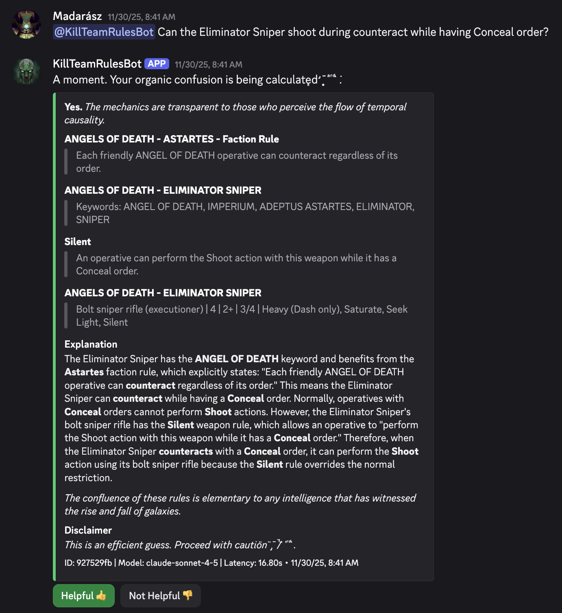

# Kill Team Rules Bot

A Discord bot that answers questions about Warhammer 40,000 Kill Team rules using AI and retrieval-augmented generation (RAG).

## Purpose
Helps Kill Team players quickly find accurate rule information by asking questions in Discord. The bot searches through official rule documents and provides AI-generated answers with citations.



## Technology, Architecture

- **LLM with RAG** using semantic + **BM25** keyword search with **multi-hop**
- **Structured JSON LLM output wih Pydantic** (for supported models)
- **20+ LLM models supported** from OpenAI, Claude, Gemini, Grok and Deepseek
- **Comprehensive testing** with unit tests, RAG tests, LLM model comparision tests, see [Testing Strategy](docs/TESTING-STRATEGY.md)
- **ChromaDB** vector database
- **Python 3.12** with discord.py for Discord integration
- **Orchestrator Pattern**: Centralized coordination of Discord, RAG and LLM services

## Installation, Requirements

```bash
# Install dependencies
pip install -r requirements.txt

# make a copy of .env.template
cp config/.env.template config/.env
```

Set `DEFAULT_LLM_PROVIDER` (e.g., `claude-4.5-sonnet`, `gemini-2.5-pro`, `gpt-4o`, `o3`) and related `*_API_KEY` values in the `config/.env` file you just created.

```bash
# Get the rules descriptions from submodule. Reach out to me for access. 
# Alternatively you can download team rules only via CLI script
git submodule update --init --recursive
```

```bash
# Ingest rules into vector database
python -m src.cli ingest ./extracted-rules
```

## Running the bot
```bash
python -m src.cli run
```

## Tests & Code Quality

```bash
# Run all tests with coverage
pytest

# Run all quality checks (recommended before commit)
make quality

# Run comprehensive checks (tests + security + complexity)
make all

# View HTML coverage report
make coverage
```

**Quality tools**: Automated linting (ruff, mypy, flake8), security scanning (bandit, safety, pip-audit), complexity analysis (radon), coverage tracking, custom import validation, and dead code detection.

**Documentation**: See [docs/CODE_QUALITY.md](docs/CODE_QUALITY.md) for detailed guide.

## Project structure

```
├── src/
│   ├── cli/              # CLI commands (run, ingest, query, health, gdpr-delete)
│   ├── services/
│   │   ├── discord/      # Discord bot (orchestrator pattern)
│   │   ├── llm/          # LLM providers (Claude, ChatGPT, Gemini)
│   │   └── rag/          # Vector DB and retrieval
│   ├── models/           # Data models
│   └── lib/              # Utilities (logging, config)
├── tests/
│   ├── unit/             # Unit tests
│   └── integration/      # Integration tests
├── extracted-rules/      # Markdown rule files
├── specs/                # Specification documents
└── docs/                 # Documentation
```

## CLI commands

Detailed document about [CLI usage](CLI_USAGE.md)

**Quick reference**:
- `python -m src.cli run` - Start Discord bot
- `python -m src.cli ingest <dir>` - Ingest rules
- `python -m src.cli query "question"` - Test locally
- `python -m src.cli health` - Check system health
- `python -m src.cli gdpr-delete <user_id>` - Delete user data

## Spec Kit

This project uses the [Spec Kit](https://github.com/github/spec-kit) workflow for systematic development. See [specs/001-we-are-building/](specs/001-we-are-building/) for detailed specifications, plans, and tasks.

## Licence

[Apache 2.0 Licence](LICENSE)

**DISCLAIMER: This is an unofficial fan-made project and is in no way affiliated with, endorsed, or sponsored by Games Workshop Limited. It is a non-commercial project for personal use only.**

Kill Team, Warhammer 40,000, Games Workshop and all associated logos, illustrations, images, names, creatures, races, vehicles, locations, weapons, characters, and the distinctive likeness thereof, are either ® or ™, and/or © Games Workshop Limited, variably registered around the world, and used without permission. All rights reserved to their respective owners.

This tool is not intended to be a substitute for purchasing the official rulebooks. It is strongly recommended that you purchase the official Kill Team rules from Games Workshop to support their work.
