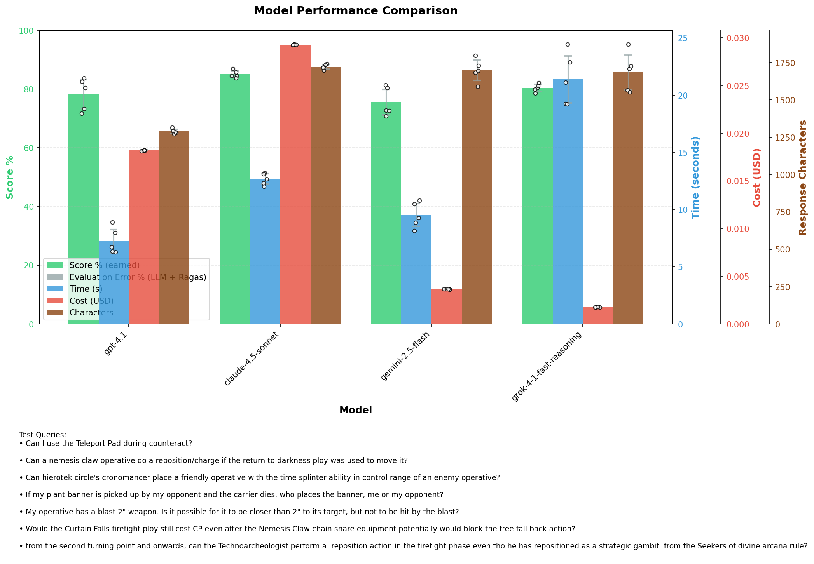
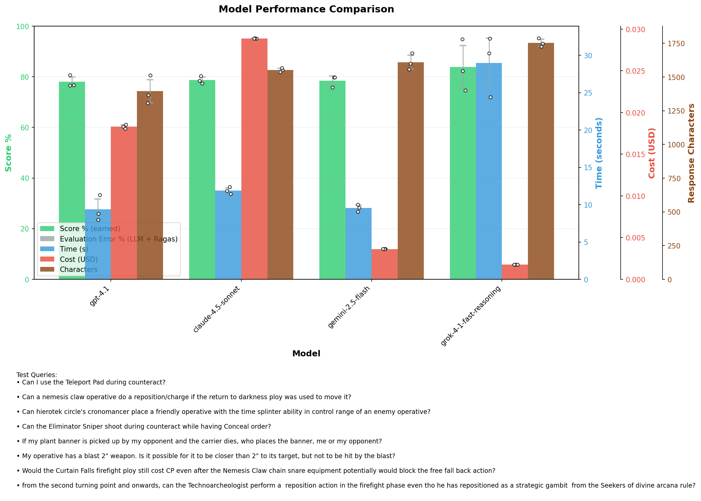
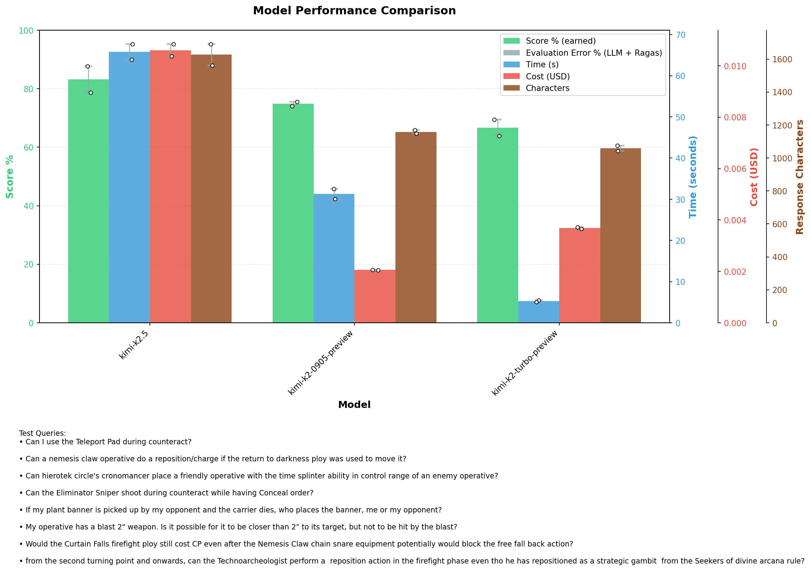
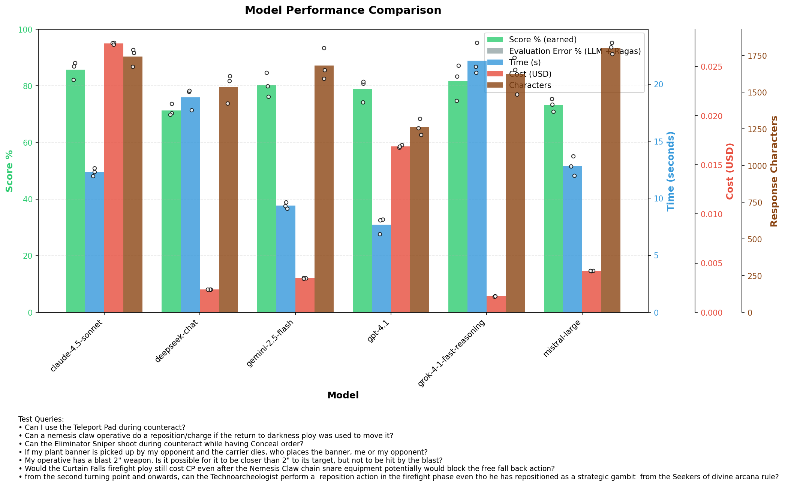

# Decisions
## LLM models removed from consideration
- `kimi-k2.5` answers are good, but it is too slow (60s+). Other Kimi models just give bad answers
- `gemini-3-flash-preview` is slower (20s+), more expensive than `gemini-2.5-flash`. It might be smarter, but sometimes has truncated JSON isse
- `gpt-5`, `grok-4-0709`, `gemini-3-pro-preview`: VERY SLOW (often around 2 mins or more)
- `gpt-5.1-chat-latest` is not that impressive, `gpt-4.1` is slightly better, slightly faster, only a little bit more expensive
- `gtp-4o` gives bad answers and is expensive
- `claude-4.6-opus`: expensive (6¢+), somewhat slow, `claude-4.5-sonnet` still generates better answers
- `claude-4.5-opus`: expensive (6¢+), slow, does not support Pydantic JSON output, sometimes break
- `claude-4.1-opus`: 5-8x more expensive than other models, and does not preform well either (already superseeded by 4.5 Opus)
- `gemini-2.5-pro`: on par with `gemini-2.5-flash`, but slower and more expensive
- `mistral-medium` and `magistral-medium-latest` give bad answers
- `deepseek-chat` is OK, cheap, but slow. `grok-4.1-fast-reasoning` is similar, but with better results.

## Models for judging
- `gtp-4o` is unsuitable as a judge, it has a lot of false negative judgements,`claude-4.5-opus` is great, but it is very expensive. `claude-4.5-sonnet` is too permissive. `claude-4.5-haiku` is promising as a judge.

# Test results

## Big model test - 2026.01.30 - improved prompt

[DETAILED REPORT](2026-01-30_prompt_v3_model_comparison.md)

## Big model test - 2026.01.28
- added new test `timesplinter-to-control-range`

| Model | Avg Score % | Avg Time/Query (s) | Avg Cost/Query ($) |
|-------|-------------|--------------------|--------------------|
| grok-4-1-fast-reasoning | 83.9% (±21.9) | 28.97 (±13.19) | $0.0018 (±0.0001) |
| claude-4.5-sonnet | 78.7% (±27.0) | 11.89 (±3.40) | $0.0289 (±0.0025) |
| gemini-2.5-flash | 78.4% (±21.5) | 9.56 (±1.75) | $0.0036 (±0.0003) |
| gpt-4.1 | 78.0% (±21.3) | 9.36 (±3.63) | $0.0183 (±0.0016) |

Key takeaways:
- `gemini-2.5-flash` sometimes paraphrasing, lower Quote Faithfullness
- `grok-4-1-fast-reasoning` uses too many quotes, it's too verbose
- `grok-4-1-fast-reasoning` sometimes uncertain "I don't know"
- `claude-4.5-sonnet` struggled with test *teleport-counteract*, *timesplinter-to-control-range*

Difference in scores:
- action-in-strategic-phase
  - `claude-4.5-sonnet` 98.3% (±0.5) - great answers
  - `grok-4-1-fast-reasoning` 62.0% (±27.2) - 1 good answer, 2 "I don't know"
  - `gemini-2.5-flash` 43.0% (±4.2) - thiks Fall Back during Strategy phase limits same actions during activation
  - `gpt-4.1` 38.0% (±5.7) - thiks Fall Back during Strategy phase limits same actions during activation
- chain-snare-vs-curtain-falls
  - `claude-4.5-sonnet` 92.7% (±0.9) - good answers
  - `gemini-2.5-flash` 87.7% (±1.2) - bad Quote Faithfullness
  - `gpt-4.1` 86.3% (±1.9) - lower Quote Recall, but great explanations
  - `grok-4-1-fast-reasoning` 74.3% (±26.4) - 1 "I don't know"
- eliminator-concealed-counteract *- almost every model above 97%, test could be retired*
  - `gtp-4.1` 91.7% (±2.5) - missed the most contexts, failing to cite the Eliminator's Keywords (proving ANGEL OF DEATH) in multiple runs
- missing-context - almost every model above 94%
  - `gemini-2.5-flash` 67.7% (±26.8) - 1 hallucinated answer, slight paraphrasing
- non-reciprocal-blast *- no or rare good answers, hardest question, nice indicator for future improvements*
  - `claude-4.5-sonnet` 78.7% (±7.6)
  - `gpt-4.1` 74.3% (±11.5)
  - `grok-4-1-fast-reasoning` 63.3% (±18.6) - cites too many rules
  - `gemini-2.5-flash` 56.3% (±5.0) - cites too many rules
- strategic-double-action
  - `gemini-2.5-flash` 91.3% (±8.0) and `gpt-4.1` 80.7% (±10.5) sometimes left out important COVERT GUISES rule
- teleport-counteract *- should LLMs know that teleports are more than 2" apart? might be a bad test -*
  - `gpt-4.1` 96.0%
  - `gemini-2.5-flash` 89.7% (±2.9) - Quote Faithfullness issue
  - `grok-4-1-fast-reasoning` 82.7% (±18.2) - 1 "I don't know"
  - `claude-4.5-sonnet` 30.7% (±0.5) - wrong quotes, bad answer, confuses 2" with 2 AP
- timesplinter-to-control-range *- REANIMATION PROTOCOL quote should be added as required -*
  - `gpt-4.1` 62.3% (±24.6) - conflicting short answer and explanation
  - `claude-4.5-sonnet` 36.3% (±2.4) - generalizes REANIMATION PROTOCOL instead of using it as a counter example

## Kimi test - 2026.01.28

| Model | Avg Score % | Avg Time/Query (s) | Avg Cost/Query ($) |
|-------|-------------|--------------------|--------------------|
| kimi-k2.5 | 83.2% (±19.7) | 65.78 (±19.43) | $0.0106 (±0.0031) |
| kimi-k2-0905-preview | 74.8% (±26.7) | 31.31 (±10.25) | $0.0021 (±0.0002) |
| kimi-k2-turbo-preview | 66.7% (±29.8) | 5.29 (±1.54) | $0.0037 (±0.0010) |

## Big model test - 2025.12.09

|Model                   | Avg Score % | Avg Time/Query | Avg Cost/Query|
|------------------------|-------------|----------------|---------------|
|claude-4.5-sonnet       | 85.7%       | 12.30s         | $0.0273       | 
|grok-4-1-fast-reasoning | 81.7%       | 22.06s         | $0.0016       |
|gemini-2.5-flash        | 80.2%       | 9.36s          | $0.0035       |
|gpt-4.1                 | 78.8%       | 7.70s          | $0.0169       |
|mistral-large           | 73.2%       | 12.83s         | $0.0042       |
|deepseek-chat           | 71.3%       | 18.84s         | $0.0023       |
These models have decent scores:
- BEST ANSWERS: `claude-4.5-sonnet`
- CHEAPEST, BUT SLOW: `grok-4-1-fast-reasoning`
- CHEAP, BUT FAST: `gemini-2.5-flash`
- FASTEST, MOST COMPACT ANSWERS: `gpt-4.1`

## Comprehensive quality tests - 2025.12.03
- Improved quality tests: Fuzzy search for **quotes faithfullness**, custom judge LLM for **explanation faithfullness** and **answer correctness**. Validates test results and test case data.

## Compared 3 questions and their answers for different models with Gemini 3 Pro
- `gtp-5.1-chat-latest`: Elite, best rule hierarchy. Cost: great, Latency: fast (<10s)
- `grok-4-1-fast-reasoning`: Elite, excellent clarity and structure. Cost: super cheap, Latency: SLOW (~35s)
- `claude-4.5-opus`: Solid, reliable. Cost: Expensive, Latency: OK (~12s)
- `gemini-2.5-flash`: Solid, reliable. Cost: cheap, Latency: fast (<10s), MOST VERBOSE - TODO: does it fail with 503 sometimes?
- `claude-4.5-sonnet`: Failed one question - TODO: Is it unreliable?
- `gtp-4.1`: Low, robotic, dry. Cost: OK, Latency: very fast (<5s)

## Gemini File Search - 2025.11.15
- Implemented it on branch `gemini-file-search`
- Results are bad, used default chunking strategy (token lenght based)

## Multihop 2 tests - 2025.11.14.
### If my plant banner is picked up by my opponent and the carrier dies, who places the banner, me or my opponent?
- "Place Marker" rule is not retrieved by RAG
- These models HALLUCINATE non-existing rules: Sonnet, GPT 4.1, 
- GPT-4o: quotes an unrelated FAQ, but does not hallucinate
- grok-4-fast-reasoning: admits that there's no such rule, quotes scoring rule additionally

## New Ragas based quality tests - 2025.10.25.
### Can the Eliminator Sniper shoot during counteract while having Conceal order?
#### Claude-4.5-Haiku
- quotes "counteract has no action restriction" instead of "Astartes"
- thinks counteract having no action restriction lets you counteract on Conceal
- flavor text does not vary
#### Claude-4.5-Sonnet ⭐
- correctly quotes "Astartes", "Silent", "Conceal"
- correct explanation
- flavor text does not vary
#### Deepseek-chat
- quotes "Silent", "Counteract" with designer notes (action restriction)
- thinks counteract having no action restriction lets you counteract on Conceal
- VERY CHEAP
#### Gemini-2.5-pro ⭐
- needs 2048 max tokens
- quotes "Astartes", "Silent", "Counteract" (long)
- correct explaination, "the operative performs a **1AP** action for free" as extra
- not much variation in flavor text
#### Gemini-2.5-flash
- needs 2048 max tokens
- fails JSON output 2/5 times
- quotes "AoD Astartes" (sometimes calls it "AoD Faction rule"), "Conceal", "Silent", "Counteract", "Eliminator" (once)
- correct explaination, "the operative performs a **1AP** action for free" as extra
- not much variation in flavor text
#### GTP-4.1
- quotes vary a lot: "Silent" (5), "Eliminator" (5), "Counteract" (sometimes the designer's notes), "Conceal" (2), once wrong "FAQ" in title
- "Astartes" rule is missing from explanation
#### GTP-4.1 mini
- quotes "Silent", "Conceal", "Astartes", "Counteract" (designer's note), Goremongers(!) rule once
- bold formatting is missing
- "Counteract only on engage" completely missing, usual "no action restriction" confusion
- flavor text does not vary
#### GTP-4o
- quotes "Silent", "Astartes", "Counteact designer's note"
- explanation has "no action restriction"
- flavor text does not vary
#### Grok 3
- quotes "Conceal", "AoD Faction rule"
- asnwer is NO, fails to find "Silent"
- short answer flavor does not vary
#### Grok 3 mini
- Very random. Answers sometimes Yes, sometimes No
#### Grok 4 fast reasoning 👍
- quotes "Silent", "Astartes", "Counteract WITH desinger's note"
- reasoning is good, + unnecessary "no action restriction"
- most verbose
### Would the Curtain Falls firefight ploy still cost CP even after the Nemesis Claw chain snare equipment potentially would block the free fall back action?
Some models don't display **Chain Snare**, it's OK, the FAQ explicitly mentions it.
**Claude-4.5-Sonnet**, **GTP-4.1-mini** and **Grok 3** produce quite long answer.
### Can a dude get guard shot more than once during an activation?
All models answer correctly. Sometimes **Claude-4.5-Sonnet** and **Claude-4.5-Haiku** even found the Deathwatch Marksman that can counteract twice.

---

## Converted rules headings from ALL CAPS to Title Case, implemented query keyword normalization - 2025-10-13
- `GPT-4.1` scores dropped from 85.3% to 72.7% after Title Case headers and query keyword normalization
- `GPT-4.1` scores 62.8% if Title Case headers are used WITHOUT normalization
- `GPT-4.1` scored 77.7% after returning back to ALL CAPS headers and turnin normalization OFF
- possible reasons for perfomance drop:
    - configurable personalities
    - removing summaries and key numerical rules? (scored 79.4% after putting them back)

## Comparing OpenAI models - 2025-10-08
- `GPT-4.1` is the most promising, 77% score, 6s to reply, $0.02 cost
- `GTP-o3` is also nice, 80% score, $0.01 cost, unfortunately slower: 24s to reply
- `GPT-5` is extremely slow, usually 2 minutes is not enough to get a reply
- `GPT-5-mini` is also slow, more than 40s in average, sometimes timing out

| Model | Avg Score | Avg Time | Avg Cost | Avg Chars |
|-------|-----------|----------|----------|-----------|
| gpt-4.1 | 76.9% (±34.3%) | 6.27s (±1.63s) | $0.0216 (±$0.0057) | 1221 (±388) |
| gpt-4o | 44.1% (±37.8%) | 6.93s (±1.87s) | $0.0267 (±$0.0073) | 888 (±242) |
| gpt-5-mini | 65.9% (±44.7%) | 37.70s (±16.99s) | $0.0056 (±$0.0024) | 1661 (±830) |
| o3 | 79.5% (±32.3%) | 23.63s (±11.97s) | $0.0135 (±$0.0041) | 1021 (±252) |
| o3-mini | 56.2% (±39.6%) | 15.92s (±4.93s) | $0.0138 (±$0.0037) | 921 (±169) |
| o4-mini | 57.5% (±45.0%) | 19.03s (±8.66s) | $0.0138 (±$0.0038) | 851 (±266) |

