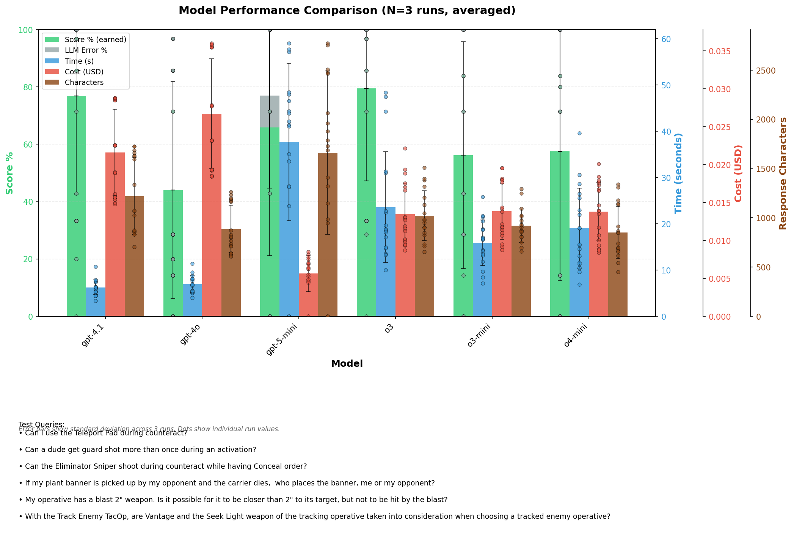

# Decisions
## LLM models removed from consideration
- `GPT-5`, `grok-4-0709`: VERY SLOW (often around 2 mins or more)
- `Claude Opus 4.1`: 5-8x more expensive than other models, and does not preform well either

## To improve
- flavor text variation
- Gemini models fail in quality tests, but are working in query, might be a bug.
- Gemini models often fail with RECITATION error, blocking the response

# Test results
## New Ragas based quality tests - 2025.10.25.
### Can the Eliminator Sniper shoot during counteract while having Conceal order?
#### Claude-4.5-Haiku
- quotes "counteract has no action restriction" instead of "Astartes"
- thinks counteract having no action restriction lets you counteract on Conceal
- flavor text does not vary
#### Claude-4.5-Sonnet ⭐
- correctly quotes "Astartes", "Silent", "Conceal"
- correct explanation
- flavor text does not vary
#### Deepseek-chat
- quotes "Silent", "Counteract" with designer notes (action restriction)
- thinks counteract having no action restriction lets you counteract on Conceal
- VERY CHEAP
#### Gemini-2.5-pro ⭐
- needs 2048 max tokens
- quotes "Astartes", "Silent", "Counteract" (long)
- correct explaination, "the operative performs a **1AP** action for free" as extra
- not much variation in flavor text
#### Gemini-2.5-flash
- needs 2048 max tokens
- fails JSON output 2/5 times
- quotes "AoD Astartes" (sometimes calls it "AoD Faction rule"), "Conceal", "Silent", "Counteract", "Eliminator" (once)
- correct explaination, "the operative performs a **1AP** action for free" as extra
- not much variation in flavor text
#### GTP-4.1
- quotes vary a lot: "Silent" (5), "Eliminator" (5), "Counteract" (sometimes the designer's notes), "Conceal" (2), once wrong "FAQ" in title
- "Astartes" rule is missing from explanation
#### GTP-4.1 mini
- quotes "Silent", "Conceal", "Astartes", "Counteract" (designer's note), Goremongers(!) rule once
- bold formatting is missing
- "Counteract only on engage" completely missing, usual "no action restriction" confusion
- flavor text does not vary
#### GTP-4o
- quotes "Silent", "Astartes", "Counteact designer's note"
- explanation has "no action restriction"
- flavor text does not vary
#### Grok 3
- quotes "Conceal", "AoD Faction rule"
- asnwer is NO, fails to find "Silent"
- short answer flavor does not vary
#### Grok 3 mini
- Very random. Answers sometimes Yes, sometimes No
#### Grok 4 fast reasoning 👍
- quotes "Silent", "Astartes", "Counteract WITH desinger's note"
- reasoning is good, + unnecessary "no action restriction"
- most verbose
### Would the Curtain Falls firefight ploy still cost CP even after the Nemesis Claw chain snare equipment potentially would block the free fall back action?
Some models don't display **Chain Snare**, it's OK, the FAQ explicitly mentions it.
**Claude-4.5-Sonnet**, **GTP-4.1-mini** and **Grok 3** produce quite long answer.
### Can a dude get guard shot more than once during an activation?
All models answer correctly. Sometimes **Claude-4.5-Sonnet** and **Claude-4.5-Haiku** even found the Deathwatch Marksman that can counteract twice.

---

## Converted rules headings from ALL CAPS to Title Case, implemented query keyword normalization - 2025-10-13
- `GPT-4.1` scores dropped from 85.3% to 72.7% after Title Case headers and query keyword normalization
- `GPT-4.1` scores 62.8% if Title Case headers are used WITHOUT normalization
- `GPT-4.1` scored 77.7% after returning back to ALL CAPS headers and turnin normalization OFF
- possible reasons for perfomance drop:
    - configurable personalities
    - removing summaries and key numerical rules? (scored 79.4% after putting them back)

## Comparing OpenAI models - 2025-10-08
- `GPT-4.1` is the most promising, 77% score, 6s to reply, $0.02 cost
- `GTP-o3` is also nice, 80% score, $0.01 cost, unfortunately slower: 24s to reply
- `GPT-5` is extremely slow, usually 2 minutes is not enough to get a reply
- `GPT-5-mini` is also slow, more than 40s in average, sometimes timing out

| Model | Avg Score | Avg Time | Avg Cost | Avg Chars |
|-------|-----------|----------|----------|-----------|
| gpt-4.1 | 76.9% (±34.3%) | 6.27s (±1.63s) | $0.0216 (±$0.0057) | 1221 (±388) |
| gpt-4o | 44.1% (±37.8%) | 6.93s (±1.87s) | $0.0267 (±$0.0073) | 888 (±242) |
| gpt-5-mini | 65.9% (±44.7%) | 37.70s (±16.99s) | $0.0056 (±$0.0024) | 1661 (±830) |
| o3 | 79.5% (±32.3%) | 23.63s (±11.97s) | $0.0135 (±$0.0041) | 1021 (±252) |
| o3-mini | 56.2% (±39.6%) | 15.92s (±4.93s) | $0.0138 (±$0.0037) | 921 (±169) |
| o4-mini | 57.5% (±45.0%) | 19.03s (±8.66s) | $0.0138 (±$0.0038) | 851 (±266) |

