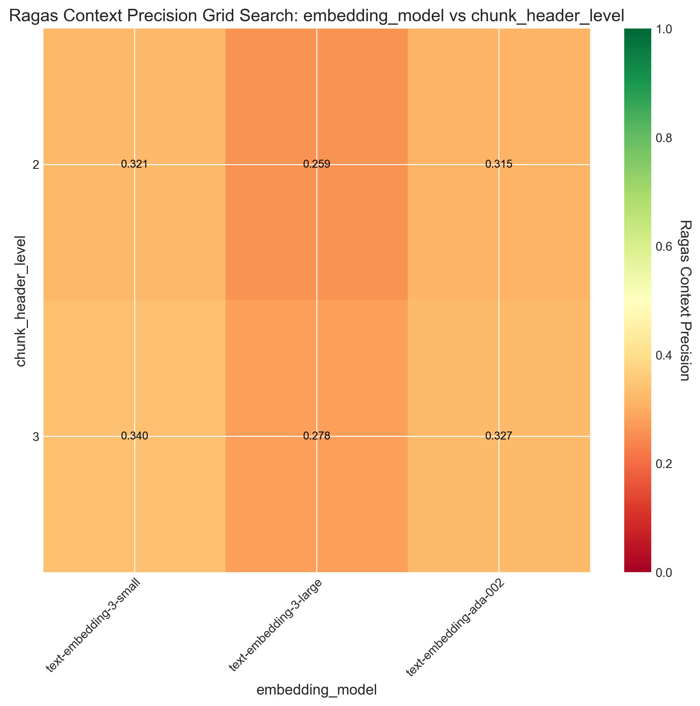
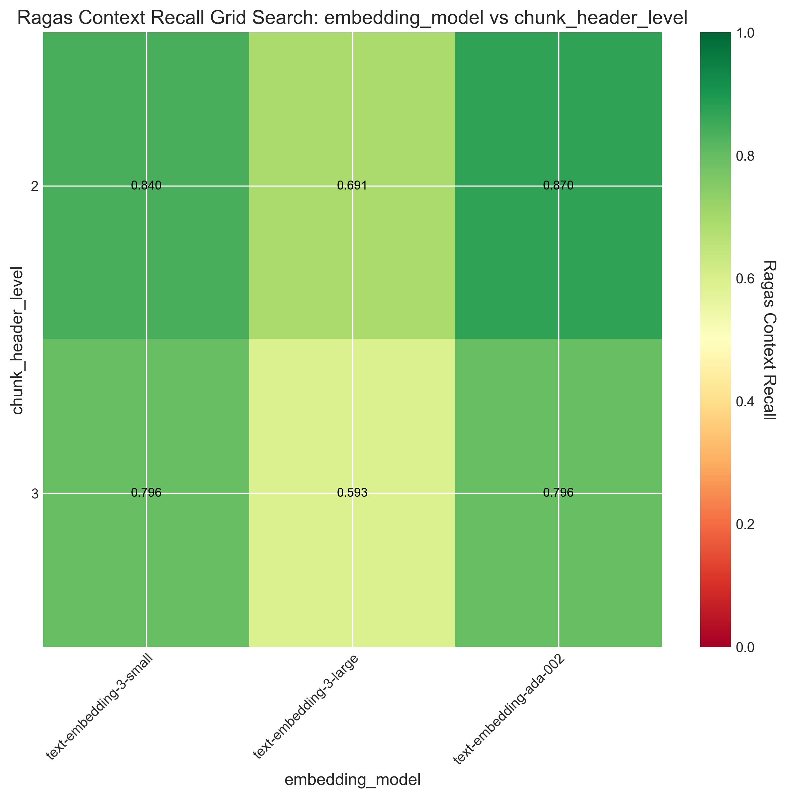

# Hop judge test 2025.10.26.
`Claude-4.5-Haiku` is worse than `GTP-4.1-mini` as a hop judge. +1s execution time, GTP finds occasionally more chunks and uses less hops
# Multi-hop improvement 2025.11.16
Measurements:
- Baseline hopping, hops 1: `BL1`
- Baseline hopping, hops 2: `BL2`
- Improved hopping, hops 1: `I1`
- Improved hopping, hops 2: `I2`
- Improved hopping with all team rules, hop 2: `I2+`
- Improved hopping with selective team rules, hop 2: `I2S`
### Total precision, recall
| Metric | BL1 | BL2 | I1 | I2 | I2+ | I2S |
|--------|-----|-----|----|----|-----|-----|
| **Context Precision** | 0.267 | 0.249 | 0.287 | 0.249 | 0.259 | 0.264 |
| **Context Recall** | 0.914 | 0.934 | 0.930 | 0.943 | 0.952 | 0.952 |
### Hopping
| Metric | BL1 | BL2 | I1 | I2 | I2+ | I2S |
|--------|-----|-----|----|----|-----|-----|
| **Avg Hops Used** | 0.90 | 1.84 | 0.78 | 1.72 | 1.68 | 1.75 |
| **Avg Ground Truth Found in Hops** | 0.19 | 0.46 | 0.30 | 0.51 | 0.59 | 0.57 |
| **Can Answer Recall** | 1.000 | 1.000 | 1.000 | 0.938 | 1.000 | 0.967 |
| **Can Answer Precision** | 0.308 | 0.247 | 0.354 | 0.240 | 0.251 | 0.232 |
| **Ground Truth in Hop 1** | 28 | 50 | 44 | 53 | 64 | 70 |
| **Ground Truth in Hop 2** | - | 16 | - | 21 | 22 | 13 |
### Hop evaluation cost (gtp 4.1 mini)
- Improved hopping: ~$0.014
- Improved hopping with all team rules: ~$0.021
- Improved hopping with selective team rules: ~$0.007

# Added multi-hop 2025.10.22
Hopping, `gtp-4.1-mini` as hop judge, `RAG_MAX_CHUNKS` = 7, `RAG_HOP_CHUNK_LIMIT` = 5, 
| Metric | Value | Description |
|--------|-------|-------------|
| **Context Precision** | 0.315 | Proportion of retrieved contexts containing ground truth |
| **Context Recall** | 0.937 | Proportion of ground truth found in retrieved contexts |
| **Avg Hops Used** | 0.87 | Average number of hops performed per test |
| **Avg Ground Truth Found in Hops** | 0.23 | Average number of ground truth chunks found via hops |
| **Can Answer Recall** | 1.000 | Proportion of times LLM hopped when ground truth was missing |
| **Can Answer Precision** | 0.341 | Proportion of hops that were made when ground truth was actually missing |

Trying smaller chunk numbers, `RAG_MAX_CHUNKS` = 5, `RAG_HOP_CHUNK_LIMIT` = 3
| Metric | Value | Description |
|--------|-------|-------------|
| **Context Precision** | 0.365 | Proportion of retrieved contexts containing ground truth |
| **Context Recall** | 0.853 | Proportion of ground truth found in retrieved contexts |
| **Avg Hops Used** | 0.93 | Average number of hops performed per test |
| **Avg Ground Truth Found in Hops** | 0.34 | Average number of ground truth chunks found via hops |
| **Can Answer Recall** | 1.000 | Proportion of times LLM hopped when ground truth was missing |
| **Can Answer Precision** | 0.480 | Proportion of hops that were made when ground truth was actually missing |

Trying smarter judge, `gtp-4.1-mini` as hop judge, `RAG_MAX_CHUNKS` = 7, `RAG_HOP_CHUNK_LIMIT` = 5
| Metric | Value | Description |
|--------|-------|-------------|
| **Context Precision** | 0.287 | Proportion of retrieved contexts containing ground truth |
| **Context Recall** | 0.958 | Proportion of ground truth found in retrieved contexts |
| **Avg Hops Used** | 0.76 | Average number of hops performed per test |
| **Avg Ground Truth Found in Hops** | 0.28 | Average number of ground truth chunks found via hops |
| **Can Answer Recall** | 1.000 | Proportion of times LLM hopped when ground truth was missing |
| **Can Answer Precision** | 0.326 | Proportion of hops that were made when ground truth was actually missing |

# Experiment - 2025.10.20
`Granuality-v2` dataset with `text-embedding-ada-002` + chunking at header level 2 seems to be the best

---

- Adjusted `BM25_B` to 0.55, because RAG sweep tests showed better `MAP` and `Recall@5` values

| bm25_b | MAP | Recall@5 | Precision@3 | MRR | Avg Time (s) | Total Cost ($) |
|------------|-------|-----------|--------------|-------|--------------|----------------|
| 0.45 | 0.767 | 0.833 | 0.444 | 0.917 | 0.317 | $0.000003 |
| 0.5 | 0.773 | 0.833 | 0.500 | 0.917 | 0.280 | $0.000003 |
| 0.55 | 0.773 | 0.833 | 0.500 | 0.917 | 0.308 | $0.000003 |
| 0.6 | 0.773 | 0.833 | 0.500 | 0.917 | 0.428 | $0.000003 |
| 0.65 | 0.766 | 0.778 | 0.500 | 0.917 | 0.309 | $0.000003 |
| 0.7 | 0.683 | 0.778 | 0.500 | 0.833 | 0.293 | $0.000003 |

- Reduced `max chunks` to 8
- Changing `BM25_K1`, `rrf_k` does not seem to affect anything
- `text-embedding-3-small` performs better than `text-embedding-3-large`